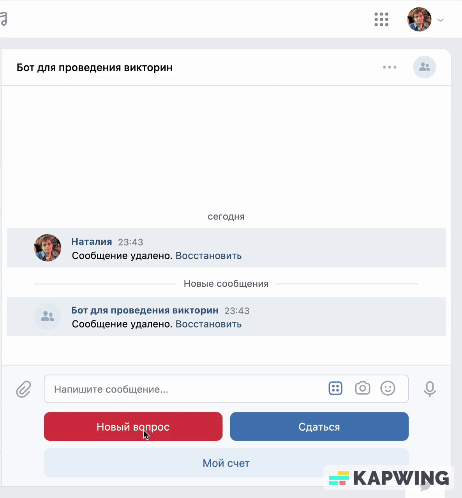

# Quiz Bots

## Overview
This project contains code for two bots: one for Telegram and another for VK (VKontakte), both designed to let people take quizzes and receive feedback on their answers.
Users can interact with the bots by answering quiz questions and receiving immediate responses based on their answers. However, as far the bots do not store user data or track user progress.
Bots just use Redis to store the current user's question and its answer.

## Prerequisites
Before you can use this script, you'll need to set up a few things:

### Bots' Tokens

**Telegram Bot Token**: You'll also need a Telegram bot token.
You can create a new bot and obtain a token by talking to the [BotFather](https://t.me/BotFather) on Telegram.

**VK API TOKEN**: To interact with a VKontakte (VK) group using the VK API, you first need to obtain a VK_API_TOKEN. Follow these steps to generate the token:

1. **Create a group in VKontakte**:
Go to the [management tab](https://vk.com/groups?tab=admin) on VK and create a new group. This group will be the one your bot interacts with.

2. **Enable message sending to the group**: Navigate to the 'Messages' tab and allow the bot to send messages to the group members.

3. **Generate the API token**: Access the 'Working with API' tab in your group’s settings. Here, you can generate the API token which your bot will use for authentication and interaction with the VK group.
Make sure to keep your VK_API_TOKEN secure and do not share it publicly to prevent unauthorized access to your VK group.

### Redis database

Visi Redislabs [website](https://redislabs.com/) to get a free Redis database link which looks like `redis-13965.f18.us-east-4-9.wc1.cloud.redislabs.com` and its port like `17689`.

### Quiz content

Bots use the quiz questions and answers from the file specified by user. The data must be list of tuples, where each turple consist of two strings, the first one is a question, the second - the answer. 
The data must be stored in the `txt` file in the pickle format.
You can get the example of the quiz data with the help of the following command:
```commandline
python get_quiz_content.py <path_to_your_archive_with_quiz_data>
```
But first you should download and unpack the archive with the quiz data via the following [link](https://dvmn.org/media/modules_dist/quiz-questions.zip). 
You should specify the path to the downloaded archive when running the `get_quiz_content.py` script. By default, the path is `./quiz-questions`. 
Also, you can specify the path to the directory where you want to save the quiz data ready for bots' usage. By default, the path is `./quiz_content.txt`.

### Python Environment

Make sure you have Python installed on your system. For this project you can use python 3.6 - 3.10. 
The project has been tested with the python 3.9 version.

## Installation
1. Clone this repository:
```
git clone git@github.com:kashaeva-dev/quizBot.git
```
2. Create virtual environment and activate it:
```bash
python -m venv env
source env/bin/activate
```
The project's functionality has been tested on Python 3.9

3. Install the required Python packages using pip:

```bash
pip install -r requirements.txt
```

4. Configuration

Create a .env file in the project directory and add the following configuration variables:

```
TG_BOT_API=<your tg_bot_token>
VK_BOT_API=<your vk_api_token>
REDIS_HOST=<host of your redis database>
REDIS_PASSWORD=<password of your redis database>
REDIS_PORT=<port of your redis database>
```
Replace variables with your actual data.

## Usage

Run the script using Python:

```
python main.py
```

This script initiates two bots that are now equipped to interact with users,
allowing them to do the quizzes.

You can run as well only telegram bot with the help of `--only_tg` argument or only vk bot by specifying the `--only_vk` argument.

For exemple:
```commandline
python main.py --only_tg
```

You can also specify the path to the file with the quiz data by using the `--quiz_data` argument. By default, the path is `../quizBot/quiz_content.txt`.

## Examples

User iteraction with the test telegram bot is look like:


User iteraction with the test vk bot is look like:

